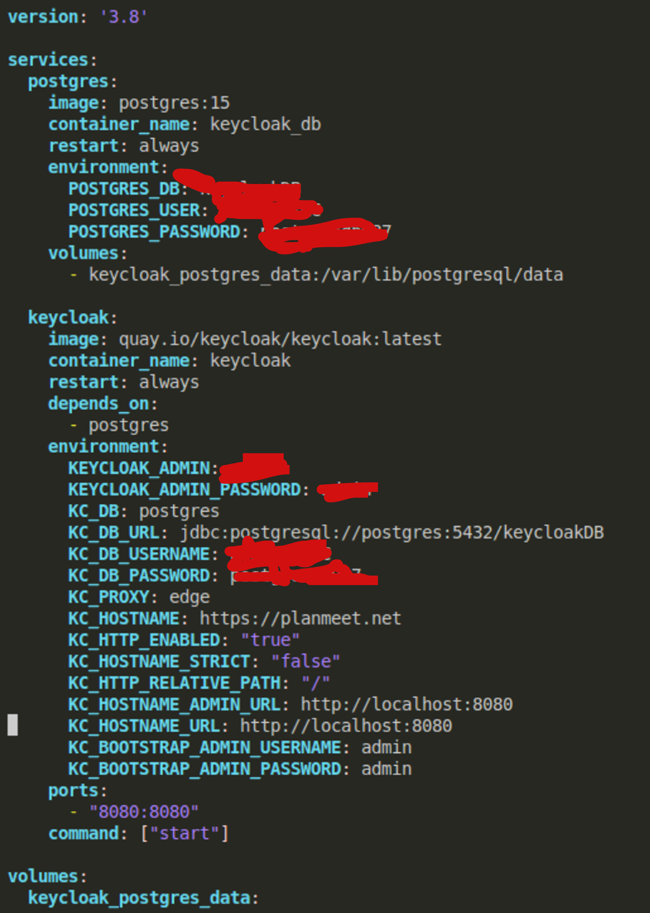

**INTRODUCTION**

This application provides a complete way of planning for development teams, via checklists (same as GitHub project board) 
and allows users with different roles to perform certain tasks.

There are 3 Roles: 
<ol>
    <li> Chief Information Officer (CIO) </li>
    <li> Product Owner (PO) </li>
    <li> Developer (Dev) </li>
</ol>

The CIO can perform the following tasks: 
<ul>
    <li> can switch between different development teams to track progress </li>
    <li> can add, modify and delete tasks </li>
    <li> can (un)assign roles and groups to users </li>
</ul>

The PO can perform the following tasks:
<ul>
    <li> can see their development team's progress</li>
    <li> can modify the status of a task (from "In progress" to "Done") </li>
    <li> can submit "Done" tasks for the CIO to review</li>
    <li> can view users but cannot assign roles or groups</li>
</ul>

The Developer can:
<ul>
  <li>see tasks</li>
  <li>see users</li>
</ul>

========================================================================================================

**Architecture explanation**

This application follows a microservice architecture, as we have 2 services in the application:
<ul>
  <li>the checklist microservice (for storing and managing checklists)</li>
  <li>the authentication microservice (anything that depends on Keycloak - users, groups, roles etc.)</li>
</ul>

The application has the following architecture: 

Next, we will explain each component of our architecture
in detail.

<ol>
    <li>
        High-Level Overview of the System Architecture.     Our
system consists of three main layers:
            <ol>
                <li>Frontend Layer: We hosted our user interface on AWS
Amplify, trying to provide a good user experience for CIOs,
POs, and developers.</li>
                <li>Microservices Layer: Our backend services include:</li>
                    <ol>
                        <li>Authentication Microservice (Keycloak-based) for
user authentication and role management</li>
                        <li>Checklist Microservice for storing and managing
                team checklists.</li>
                    </ol>
                <li>
                    Infrastructure & Cloud Services Layer: These include
the AWS components used for routing, security, and monitor-
ing. We make sure that all component is designed to be cloud-
native, modular, and scalable.
                </li>
            </ol>
    </li>
    <li> Frontend Layer: The frontend is hosted on AWS Am-
plify. This AWS service provides us with a fully managed
continuous deployment and hosting service for our web appli-
cations. The frontend allows users to interact with:
        <ol>
            <li>Dynamic checklists (for POs to update progress and
for CIOs to manage tasks).</li>
            <li>Team & role management (for CIOs to assign users)</li>
            <li>Progress tracking dashboards (for CIOs to monitor
progress across multiple teams)</li>
        </ol>
    </li>
    <li>
        Microservices Layer: This layer consists of two core
microservices:
            <ol>
                <li>
                    Authentication Microservice (Keycloak Identity
& Access Management):
        As suggested by our stakeholder, we use Keycloak, which
is a widely used Identity & Access Management (IAM)
system for us to handle authentication, authorization, and
RBAC enforcement. We run our Keycloak service on an EC2
instance to ensure secure user authentication. The system
supports secure user login/logout; Role-based access control
(RBAC) for CIOs, POs, and Developers; and token-based
authentication for secure API calls.
Since Keycloak has its own database, which is an embedded
H2 database to store user data. We did not create AWS
database related services to serve our user data; however, we
adopted a PostgreSQL (AWS RDS) database as a persistent
database solution to redundantly store user data for data
backup and data recovery. This is a good practice to enhance
our system’s reliability and resilience. By adding this AWS
RDS, we ensure that user data is securely backed up and can
be recovered efficiently in case of system failures or data loss.
This is suggested by our stakeholder in the weekly meeting.
                </li>
                <li>
                    Checklist Microservice:
This microservice is responsible for storing and managing
R&D progress checklists. We deployed this microservice on
an EC2 instance, and it exposes APIs that allows: 1) Product
Owners to submit and update checklists; 2) CIOs to create,
edit, delete checklists and track team progress; 3) developers
to view checklists in a read-only mode.
As for the storage, we used AWS DynamoDB, which is a
fully managed NoSQL database to store checklist data. One
important point is that our checklist service securely interacts
with the authentication service to enforce RBAC policies.
                </li>
            </ol>
    </li>
    <li>
        Infrastructure & Cloud Services Layer: This layer
consists of AWS-managed services to handle DNS routing,
HTTPS enforcement, secret management, and system moni-
toring. Next, we detail the key components that support the
stability and security of our system.
            <ol>
                <li>Route 53 – Domain Name System (DNS):
To enable HTTPS communication across all our microser-
vices, we need a trusted SSL certificate. To achieve this,
we use AWS Route 53 to register and manage the domain,
which ensures that all traffic to our application is routed
securely. Also, we configured each of our EC2 instances
running our microservices (Keycloak Service, Authentication
Service, Checklist Service) with an SSL certificate signed by
Let’s Encrypt (a trusted authority) on a reverse proxy (Nginx),
so that we can be sure that all microservices communicate
securely over HTTPS and prevent any insecure HTTP con-
nections between services.
By using Route 53 for domains and SSL certificates, we
ensure that we have encrypted communication across all layers
of our application. This helps us adhere to best security
practices.</li>
                <li>
                    AWS Secrets Manager – Secure Credential Storage:
Security has always been a major consideration of our
architecture, for instance, when we need to handle keys,
credentials, authentication secrets, etc. We chose to store all
confidential information in AWS Secrets Manager instead of
hardcoding these sensitive data in the code. We ensure that
this type of information is not exposed in our source code or
in any configuration files to reduce security vulnerabilities.
                </li>
                <li>
                    AWS CloudWatch – Monitoring and Logging:
Our stakeholder expects us to ensure the reliability and
performance of our microservices, so we integrated AWS
CloudWatch to centralize logging and monitor our system.
Using CloudWatch, we can easily track the CPU, memory,
disk usage, and network activity of our EC2 instance. It is a
good way to detect performance bottlenecks or even choose
to scale our services when necessary.
Also, we use CloudWatch to centralize the logs from all
our microservices to help developers trace issues and debug
errors. CloudWatch also allows us to configure alarms to notify us
when critical thresholds are reached, as we learned from the
individual assignments. By incorporating CloudWatch to do the real-time monitoring
and logging, we have increased observability over our system’s
performance and health so that we can identify and solve
issues before they have a serious negative impact on our users.
                </li>
            </ol>
    </li>
</ol>

==========================================================================

**Development & implementation**

As discussed previously, the app is broken down into com-
ponents, with each component satisfying a specific task (mi-
croservice architecture): 

<ol>
    <li>Authentication microservice, which is
responsible for every functionality involving Keycloak, includ-
ing role and group (un)assignment, fetching of user data and
authentication</li>
    <li>checklist microservice, which allows
CIO’s to modify checklists (add/delete/modify) and PO’s to
change their status and submit ”Done” checklists</li>
</ol>

The authentication service instance has 2 applications running crucial for
its functioning: the server application and the reverse proxy.
The server application is the one that provides endpoints that
are then forwarded to the Keycloak instance. The JavaScript
Keycloak library provides functionalities which allow for role
checking within the server and not directly in the Keycloak
instance, which prevent Keycloak from being overloaded with
malicious/wrong requests. For secret storage and fetching we
use AWS Secrets. All of our secrets (KeycloakURL - domain
of our keycloak instance, keycloakRealm - the ”organisation”
of the keycloak application, keycloakClientID - the id of the
application making the request, AuthServiceSecret - AWS
access token) are stored there to be used in our code both in the
client and server side. An important aspect when configuring
the application is managing the CORS (Cross Origin Resource
Sharing) settings. In the CORS settings we specify what
domains can communicate with us and we choose the client
domain and the keycloak domain for that. Providing the root
certificate for HTTPS authentication also allows the server to
authenticate the Keycloak requests.

The authentication server requires sending credentials
to the Keycloak instance in every request, which include
KeycloakRealm, keycloakClientID and Client Secret(the
application secret of the client communicating with Keycloak 
keycloak feature). In every request, the root certificate of
Keycloak’s certificate which is signed by the same CA as
the Auth server’s certificate is given so that the Keycloak
proxy can identify whether the entity that made the request
was legitimate. The authentication service contains several
endpoints that satisfy application requirements: login, fetch
roles of user, fetch groups of user, user data (all details
about a user including its roles and groups), get all users
(basic information), all roles (existing within the realm),
assigning and unassigning user to groups and roles. On this
authentication instance sits a reverse proxy which listens to
HTTPS connections from the frontend domain. This proxy
authenticates the client and proceeds to forward the request
to the server via HTTP.

The endpoints follow a similar pattern so only one will
be explained. GetUserGroups endpoint will be explained for
simplicity. This endpoint takes in a user id, sends a post
request to the keycloak application for the session token, with
keycloak realm, keycloakClientID, clientSecret, and gets the
token. Afterwards, the get request for getting the groups of
the user with the specified id is made, with the session token
just provided by the keycloak instance. We then return the
groups to the frontend.

As mentioned before, Keycloak is run as a container in
conjunction with PostgreSQL. To achieve this, a docker-
compose file is made, which runs both services at the same
time. As it can be seen in the figure below, 2 services are run, namely
keycloak and postgres. In the keycloak parameters there are
several important parameters to mention: the keycloak admin
username and password (the ones setup in the beginning
for the application, the postgres DB attached to it and the
credentials, we also need to specify that keycloak is expecting
to get proxied traffic from https://planmeet.net (which is the
proxy), and that from the proxy to itself it expects HTTP.
It listens on port 8080 at localhost as the proxy and the
keycloak container are on the same machine. The proxy is
equivalent to the one in figure 3, only it expects traffic from
auth.planmeet.net which is the authentication service backend.

The checklist service relies on a JavaScript backend server
and a DynamoDB database, alongside the Keycloak role
checking which is done by checking the client token. This
server uses the same principles discussed in the authentication
server: CORS setup to allow the frontend domain to connect,
specifying the certificate for the server and the private key and
initialising the keycloak object which allows for role checking
in the token. Now, all endpoints for the checklist service also
follow a similar pattern, namely:

<ol>
    <li>get the token from the frontend</li>
    <li>get user groups from the token</li>
    <li>if the user belongs to a group that includes CIO, then
get all the checklists of all development teams</li>
    <li>if the user doesn’t belong to any group that includes
CIO, then get a group that doesn’t include CIO. Then
get the checklists belonging to that group.</li>
</ol>

The frontend has the following components: login,
checklist view, users view, view submissions (CIO only),
submitted forms (PO only). Everything in the frontend is
built from scratch, using NextJS (React + TypeScript +
TailwindCSS). The visual aspect of the frontend includes
a left bar which gives options of what to view: checklists,
users, submissions/submitted forms and the selected view,
which shows data from the clicked category. Once clicked,
these clicked categories (checklists, users) will show up in
the clicked view as components Depending on the role given by the Keycloak token upon
login, a user can perform specific tasks in the frontend. A
CIO can add checklists for the development teams they are
assigned, they can modify their title and description, they can
view multiple dev teams checklists, they can modify user roles
and groups, by either assigning or unassigning, and they can
view checklist submissions. A PO can modify the status of a
task (from Todo to In progress for example and can submit
done checklists for the CIO to view. A regular user does not
have any management power and can only view checklists and
users.

**CIO checklists view:**

**PO checklists view:**

**CIO user management view:**

